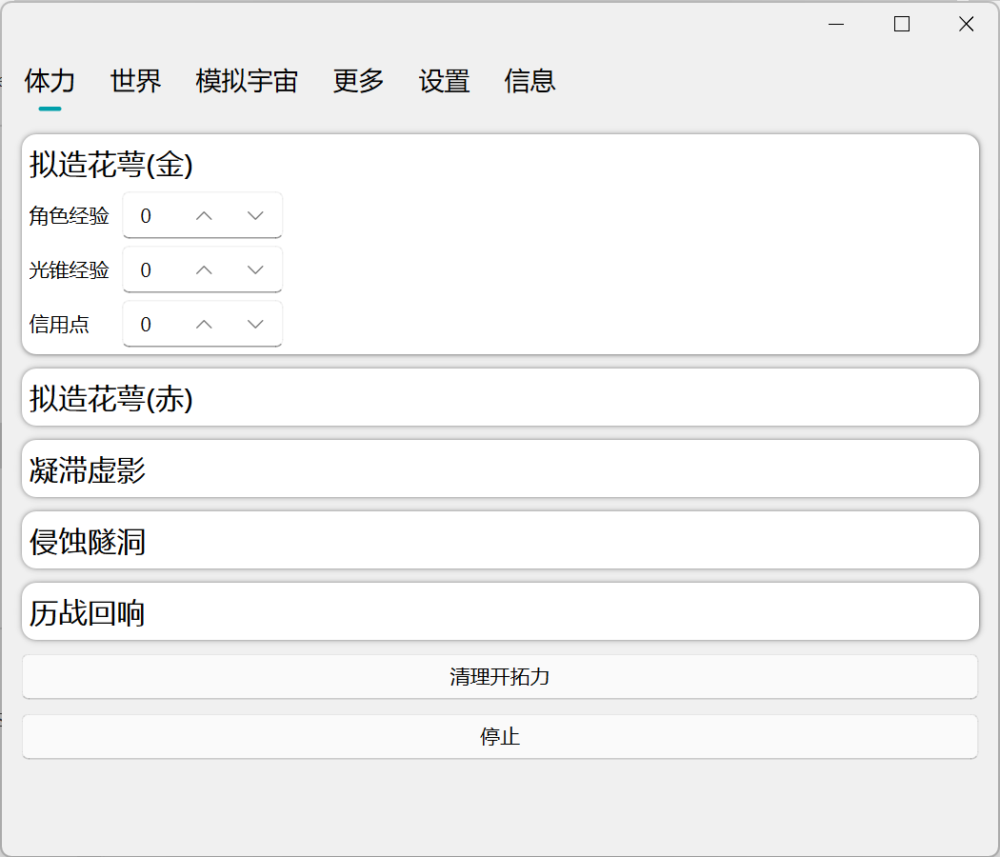
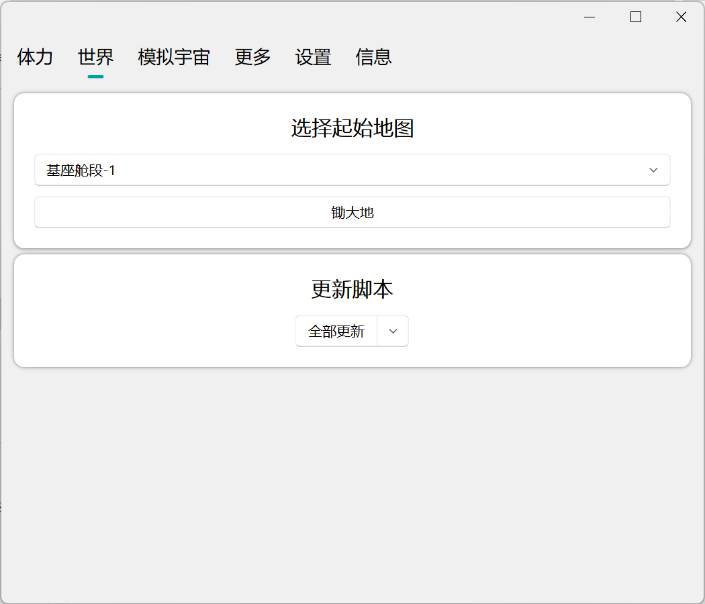
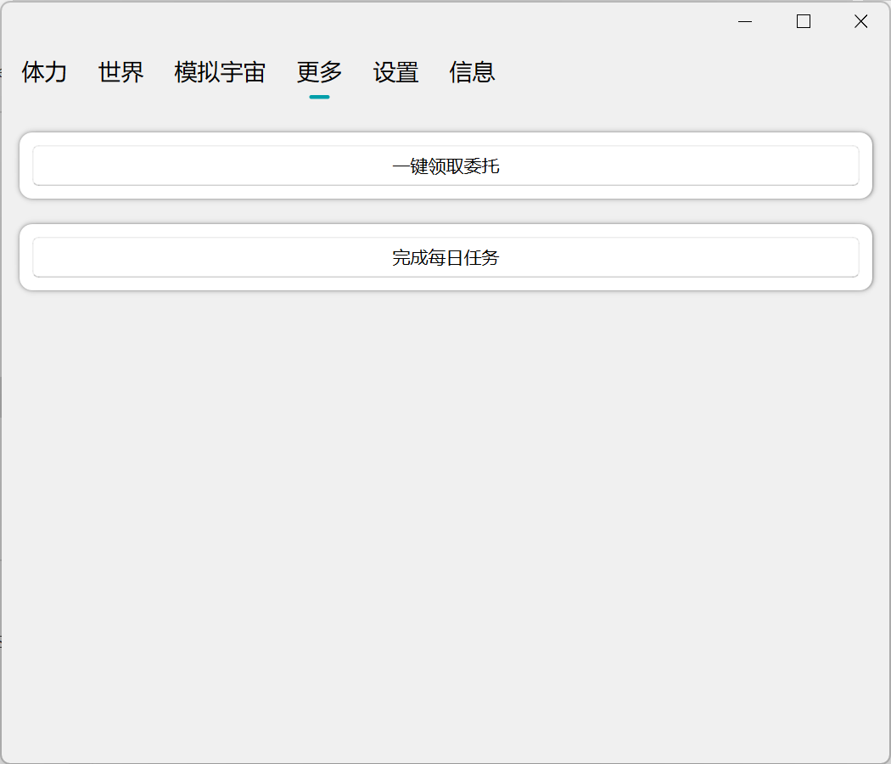

# AutoStarRail
崩坏：星穹铁道自动化 |崩坏：星穹铁道体力消耗自动化 | 自定义清理体力 | 融合`Auto_Simulated_Universe`和`StarRailAssistant`以及清理体力于一体的整合包 | 模拟按键 | 图像识别


## 免责声明

本软件是一个外部工具旨在自动化崩坏星轨的游戏玩法。它被设计成仅通过现有用户界面与游戏交互,并遵守相关法律法规。该软件包旨在提供简化和用户通过功能与游戏交互,并且它不打算以任何方式破坏游戏平衡或提供任何不公平的优势。该软件包不会以任何方式修改任何游戏文件或游戏代码。

This software is open source, free of charge and for learning and exchange purposes only. The developer team has the final right to interpret this project. All problems arising from the use of this software are not related to this project and the developer team. If you encounter a merchant using this software to practice on your behalf and charging for it, it may be the cost of equipment and time, etc. The problems and consequences arising from this software have nothing to do with it.

本软件开源、免费，仅供学习交流使用。开发者团队拥有本项目的最终解释权。使用本软件产生的所有问题与本项目与开发者团队无关。若您遇到商家使用本软件进行代练并收费，可能是设备与时间等费用，产生的问题及后果与本软件无关。

请注意，根据MiHoYo的 [崩坏:星穹铁道的公平游戏宣言](https://sr.mihoyo.com/news/111246?nav=news&type=notice):

```
"严禁使用外挂、加速器、脚本或其他破坏游戏公平性的第三方工具。"
"一经发现，米哈游（下亦称“我们”）将视违规严重程度及违规次数，采取扣除违规收益、冻结游戏账号、永久封禁游戏账号等措施。"
```


## 脚本录制

录制脚本 AutoStarRail/utils/recorded_map.py，运行即可

1. WASD移动，X映射鼠标左键，上下左右键映射鼠标移动可以用来移动角色视角，录制期间只能有一个有效按键，例如你现在正在使用W前进，那么就不要使用A或者其他的按键，脚本只会录制按键按下的时间和移动视角的次数，不会录制停顿的时间(可以慢慢录制保证准确性)。F7是暂停录制，暂停期间一切按键都不被记录，F8是结束录制。
2. 结束后会生成json文件，文件将放到recorded_map.py中filename的位置...(脚本录制暂时还没完成)
3. ...


## 注意事项

1. 识图为识别游戏画面，游戏不能被任何窗口覆盖

2. 自定义体力支持 **拟造花萼**，**凝滞虚影**，**侵蚀隧道**，**历战余响**

3. 清理体力需要角色处于**主界面**(可以看到左上角地图，左上角任务，右边角色栏等)

4. 运行清理体力该功能后尽量不要操作了，断点恢复能力不是很好

5. ~~清理体力前记得看一下脚本设置中是否开启了自动使用燃料，自动使用星穷等功能，根据自己需求来设置。~~暂时还没完成

6. 暂时不支持副本中死亡继续运行脚本，若中途死亡需要重新运行脚本

   ⭐**如果喜欢，点个星星~**⭐


## 使用

1. ~~克隆pack分支打开AutoStarRail运行main.exe就行了！不需要安装依赖！！！~~(为了配合星铁的开源作者们决定取消打包)
2. ~~打开main.exe需要使用管理员身份启动否则脚本无法正常运行！！！~~
3. 自己安装依赖运行AutoStarRail下的main.py文件即可

### 自定义清体力

按照自己需求来增加每个副本的场次，可以在进行过程中点击停止按钮来停止程序

### 锄大地

选择自己想要的开始的地图位置点击开始即可

在进行途中按下f8将在下一个地点寻路开始时结束锄大地


### 模拟宇宙

...

### 委托

开启游戏，点击一键领取即可

## 每日任务

...


## 未来目标

1. ~~GUI~~
2. ~~清理每日体力~~
3. 锄大地
4. 刷模拟宇宙
5. ~~领委托任务~~
6. 完成每日任务


## GUI展示







